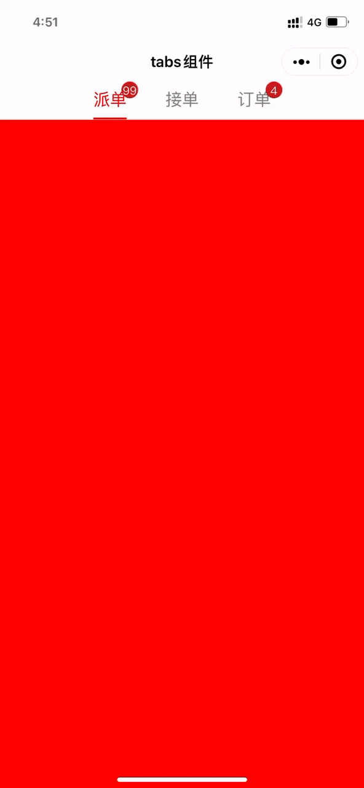

# tabs_demo
微信小程序自定义tabs组件

<div align=center>

</div>


### 使用方式
- 下载自定义tabs组件并引入新项目
1. 前往[github](https://github.com/1691665955/tabs_demo)下载tabs_demo
2. 将demo里面的components文件夹下的组件引入需要集成的项目中

- 使用组件
1. 在指定页面的json文件中注入组件
```
{
  "usingComponents": {
    "tabs": "/components/tabs/tabs",
    "tab-page": "/components/tab-page/tab-page"
  },
  "navigationBarTitleText": "tabs组件"
}
```

2. 代码示例
```
<view class="container">
  <tabs list="{{tabs}}" tab-class="tab-class" showBadge="{{true}}" swiper="{{true}}" activeColor="#FF0000" normalColor="#888888" bindchange="tabChange">
    <tab-page slot="{{item.name}}" wx:for="{{tabs}}" wx:key="name">
      <view style="height: 100%;background-color: {{colors[index]}};"></view>
    </tab-page>
  </tabs>
</view>
```

### 参数解释
- tabs
<table>

<tr>
<th>参数名</th>
<th>参数类型</th>
<th>默认值</th>
<th>说明</th>
</tr>

<tr>
<td>list</td>
<td>Array</td>
<td>[]</td>
<td>tab数组，用于显示tab名称和角标，形如[{name:"订单", count: 10}]</td>
</tr>

<tr>
<td>current</td>
<td>Number</td>
<td>0</td>
<td>当前tabs选中第几个</td>
</tr>

<tr>
<td>normalColor</td>
<td>String</td>
<td>"#101010"</td>
<td>tab未选中字体颜色</td>
</tr>

<tr>
<td>activeColor</td>
<td>String</td>
<td>"#55b428"</td>
<td>tab选中字体颜色</td>
</tr>

<tr>
<td>showBadge</td>
<td>Boolean</td>
<td>true</td>
<td>tab角标是否显示</td>
</tr>

<tr>
<td>circular</td>
<td>Boolean</td>
<td>true</td>
<td>tab-page是否可以循环滚动</td>
</tr>

<tr>
<td>swiper</td>
<td>Boolean</td>
<td>false</td>
<td>tab-page是否可以手动滑动</td>
</tr>

<tr>
<td>tab-class</td>
<td>String</td>
<td></td>
<td>tabs整体额外布局</td>
</tr>

<tr>
<td>tab-header-class</td>
<td>String</td>
<td></td>
<td>tabs头部额外布局</td>
</tr>

<tr>
<td>tab-item-class</td>
<td>String</td>
<td></td>
<td>tabs头部选项额外布局</td>
</tr>

<tr>
<td>tab-item-name-class</td>
<td>String</td>
<td></td>
<td>tabs头部选项名称额外布局</td>
</tr>

<tr>
<td>tab-item-badge-class</td>
<td>String</td>
<td></td>
<td>tabs头部选项角标额外布局</td>
</tr>

<tr>
<td>tab-page-class</td>
<td>String</td>
<td></td>
<td>tabs页面布局</td>
</tr>

<tr>
<td>bindchange</td>
<td>Function</td>
<td></td>
<td>tabs切换回调</td>
</tr>

</table>

- tab-page

<table>

<tr>
<th>参数名</th>
<th>参数类型</th>
<th>默认值</th>
<th>说明</th>
</tr>

<tr>
<td>slot</td>
<td>String</td>
<td></td>
<td>填入对应tab的name</td>
</tr>

</table>